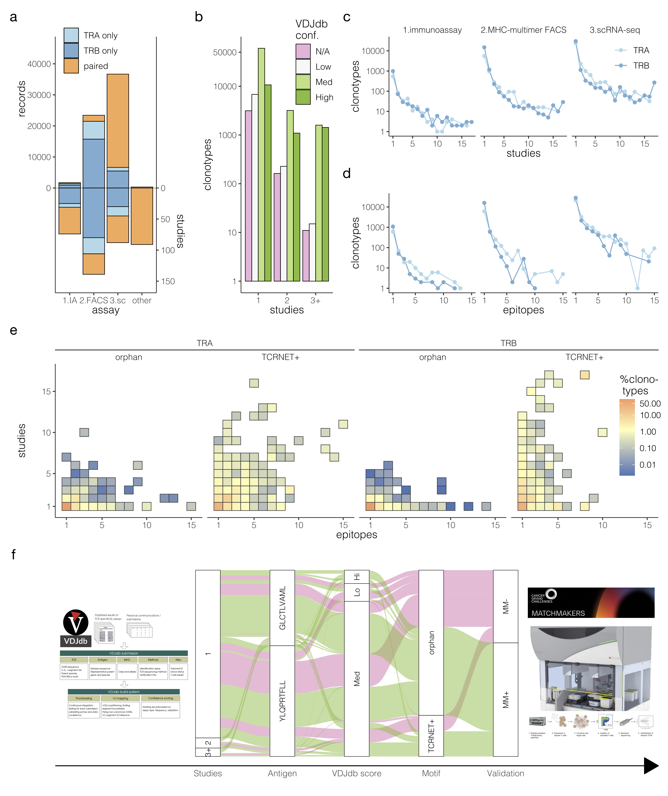

### VDJdb record validation challenge infographics

---

> Work in progress, re-analysis of [Spring challenge release](https://github.com/antigenomics/vdjdb-db/releases/tag/pyvdjdb-2025-02-21) showing efficiency and accuracy of in silico VDJdb de-noising

See also [Messemaker et al. dataset](https://github.com/schumacherlab/TCRvdb).

The code here is provided for reproducibility purposes:

- R markdown with the code and all software dependencies can be found in ``validation_analytics.Rmd``
- VDJdb dataset is stored in ``dump/`` folder, MATCHMAKERS dataset should be requested from the authors
- The R markdown can be compiled and run in R Studio
- The resulting output is provided in ``validation_analytics.pdf``